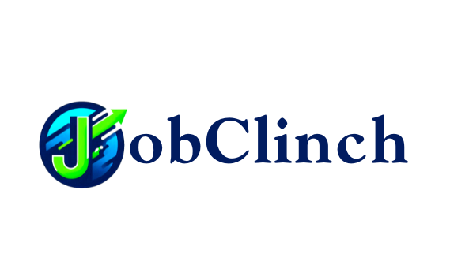

<div align="center">
  
  
  # 🚀 JobClinch Platform
  
  **A Modern, Scalable MERN Stack Job Portal**
  
  [](https://reactjs.org/)
  [](https://nodejs.org/)
  [](https://expressjs.com/)
  [](https://www.mongodb.com/)
  [](https://vitejs.dev/)
</div>

---

## 🌟 Overview
**JobClinch** is a fully-featured job portal that bridges the gap between talented job seekers and leading employers. Built with the powerful MERN stack and optimized for performance with Vite, this platform offers a seamless, secure, and intuitive experience for all users.

---

## 🔥 Key Features

### 🏢 For Employers
- **Rich Text Job Postings:** Create beautifully formatted job descriptions using an integrated rich-text editor (`react-quill`).
- **Application Tracking:** Instantly view resumes and cover letters submitted by applicants.
- **Email Alerts:** Receive automated email notifications the moment a candidate applies for your job.

### 💼 For Job Seekers
- **Advanced Search & Filtering:** Quickly find the perfect job by searching keywords, or filtering by category and city.
- **Easy Applications:** Upload your resume securely (powered by Cloudinary) and write custom cover letters.
- **Dashboard:** Keep track of all the jobs you've applied to in one place.

### 👑 For Administrators
- **Master Dashboard:** View real-time platform statistics (Total Users & Total Jobs).
- **User Management:** Monitor and instantly remove abusive or fraudulent users.
- **Content Moderation:** Have global oversight to delete inappropriate job postings.

---

## 🛠️ Technology Stack

### 🖥️ Frontend
* **Core:** React.js 18, Vite
* **Routing:** React Router DOM
* **State & Fetching:** Axios, React Context API
* **UX/UI:** React Hot Toast (Notifications), React Icons, React Quill (Rich Text Editor)

### ⚙️ Backend
* **Core:** Node.js, Express.js
* **Database:** MongoDB & Mongoose
* **Authentication:** JWT (JSON Web Tokens), bcrypt (Password Hashing), Cookie Parser
* **Cloud Infrastructure:** Cloudinary (File Storage), Express FileUpload
* **Communication:** Nodemailer (SMTP Email Notifications)

---

## 📂 Project Structure

```text
JobClinch/
│
├── frontend/               # React + Vite Application
│   ├── public/             # Static assets & CVs
│   ├── src/
│   │   ├── components/     # Reusable UI components (Layout, Modals)
│   │   ├── pages/          # Core views (Home, Auth, Jobs, Admin)
│   │   ├── App.jsx         # App Entry & Routing
│   │   └── main.jsx        # React DOM render
│   └── vite.config.js
│
└── backend/                # Node.js + Express API
    ├── src/
    │   ├── controllers/    # API Request Handlers
    │   ├── database/       # MongoDB Connection Configuration
    │   ├── middlewares/    # Authentication (JWT) & Error Handlers
    │   ├── models/         # Mongoose Schemas (User, Job, Application)
    │   ├── routes/         # Express API Routes
    │   └── utils/          # Helpers (Token generation, Nodemailer)
    ├── app.js              # Express App Configuration
    └── server.js           # Server Entry Point
```

---

## ⚙️ Local Development Setup

### 1. Prerequisites
- Node.js installed
- MongoDB installed locally or a MongoDB Atlas URI
- Cloudinary Account
- Mailtrap or standard SMTP details

### 2. Backend Setup
Navigate to the backend directory and install dependencies:
```bash
cd backend
npm install
```

Create a `config/config.env` file in the `backend` directory:
```env
PORT=4000
CLOUDINARY_CLIENT_NAME=your_cloud_name
CLOUDINARY_CLIENT_API_KEY=your_api_key
CLOUDINARY_CLIENT_API_SECRET=your_api_secret

FRONTEND_URL=http://localhost:5173

MONGO_URI=your_mongodb_connection_string

JWT_SECRET_KEY=your_jwt_secret
JWT_EXPIRES=7d
COOKIE_EXPIRE=7

# Email Config
SMTP_HOST=sandbox.smtp.mailtrap.io
SMTP_PORT=2525
SMTP_USER=your_user
SMTP_PASS=your_password
SMTP_FROM_NAME=JobClinch
SMTP_FROM_EMAIL=noreply@jobclinch.com
```

Start the backend server:
```bash
npm run dev
```

### 3. Frontend Setup
Navigate to the frontend directory and install dependencies:
```bash
cd frontend
npm install
```

Start the Vite development server:
```bash
npm run dev
```

---

<div align="center">
  <i>Built with ❤️ for a better hiring experience.</i>
</div>
